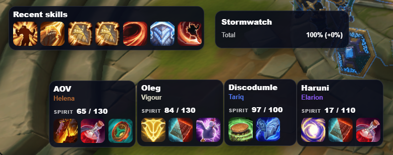
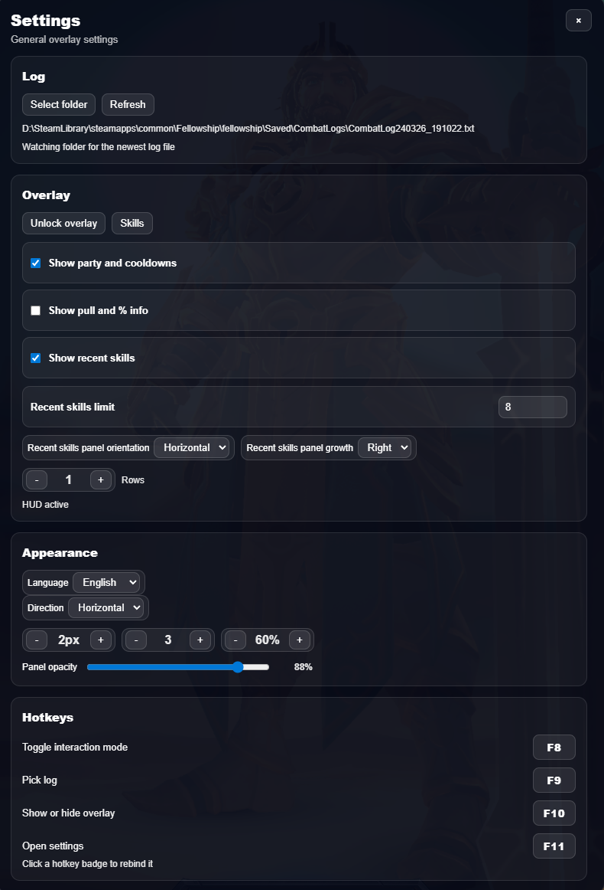
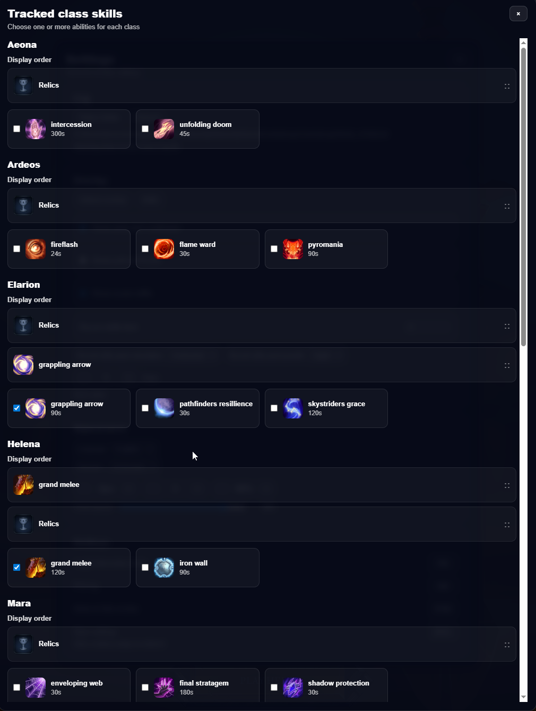

> [!NOTE]
> **Fork of [Fellowship Overlay by aovzerk](https://github.com/aovzerk/Fellowship-overlay)** (MIT).
> This fork keeps all of the original overlay and adds per-hero dungeon score
> tracking and a rotation optimizer. Full credit for the base overlay goes to the
> original author.

> [!IMPORTANT]
> If you are worried about using this overlay, we have confirmation from the developers that it is allowed and players will not be punished for using it before official in-game support.
>
> **Developer statement (CR_Jupiter):**
>
> "Hello! I am back with news about the overlay:
>
> Adding trackers to relics, spirit abilities and more is something we want to be doing anyways (that is also including current pull % etc.) so we won't be punishing players who want to use it before official in-game support
>
> Anyone who want's to use it can, go ham 🍔"
>
> Source: CR_Jupiter
> https://discord.com/channels/1254866410258038845/1268395520846467226/1485956620503617697

# Fellowship Dungeon Score Overlay

Lightweight in-game overlay for tracking party members, relics, Spirit values, skill cooldowns, and recent actions in real time using combat logs — extended with **dungeon best scores** and a **rotation optimizer** that tells you which dungeon to run next to gain score fastest.

> [!IMPORTANT]
> You must enable **ADVANCED COMBAT LOGS** in the game settings, otherwise the overlay will not receive the data it needs to work correctly.

## Features

Base overlay (from upstream):

- Real-time player tracking from the combat log
- Spirit (numeric), equipped relics with cooldown visualization, selected skill cooldowns (gem-bonus aware), recent skills, pack percent (in dev)
- Smart Spirit highlighting, draggable UI, system-tray settings

Added in this fork:

- **Dungeon best scores panel** — your highest score per dungeon, tracked **per hero**, persisted across sessions. Shows while you're out of a run (picking a dungeon) and hides during one.
- **Rotation optimizer ("Run next")** — for each hero, uses their current Eternal level to show the offered dungeons ranked by scarcity: the dungeon that won't come back for the most levels is listed first, so you capture its score now instead of waiting.
- **Deselectable relics** — relics can be toggled off per class in the skills modal (previously always on).
- **Run-scoped tracking** — relics and spell cooldowns only render during an active dungeon run; scores/optimizer only show outside a run.

## Dungeon scores & rotation optimizer

Scores come straight from the combat log's `DUNGEON_END` events (the same number the in-game Dungeon Records screen shows), recorded per hero and only for the current season. On selecting your log folder the overlay also backfills from existing logs.

The rotation model is deterministic for Season 3: normal dungeons repeat on a **10-level cycle** and the capstone on a **4-level cycle**, validated against public ranking data. "Run next" reads your highest cleared tier as your current Eternal level and ranks what to run from there. Heroes below Eternal show no recommendation.

**Where your scores are stored:** `settings.json` next to the app's `.exe` (portable launch folder). Keep the `.exe` in a normal writable folder — not `Program Files` — and your scores persist across sessions. Writes are atomic with a `.bak` fallback, so a crash mid-save can't wipe your records.

## Controls

- **F8** — Toggle overlay lock (locked = click-through for play; unlocked = interactive for dragging)
- **F9** — Select log file
- **F10** — Show or hide overlay
- **F11** — Open settings

## Join the Community

**Discord community:** [https://discord.gg/82BeHyQEeR](https://discord.gg/82BeHyQEeR)

## Screenshots





## Installation

- Download the `.exe` and run it (keep it in a writable folder so scores can save)
- Enable **ADVANCED COMBAT LOGS** in the game settings

## Dev

- Node.js 20+

```bash
npm i          # install dependencies
npm start      # run in development mode
npm run dist   # build the portable .exe
```
